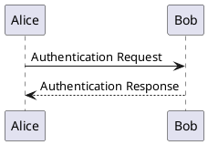

# Pandoc Professional PDF Converter

This project provides a self-contained Docker environment to convert complex Markdown documents into professional-looking PDF files. It is specifically designed to handle Markdown that includes **PlantUML** and **Mermaid** textual diagrams, applying a complete corporate templating system.

## Problem Solved

The need is to overcome the limitations of standard converters, which often do not support advanced templating features such as:
- Company logos
- Custom headers and footers
- Cover page
- Automatic Table of Contents
- Consistent styles for tables, code, and other elements

This project solves these issues by leveraging the power of Pandoc and LaTeX within a reproducible Docker environment.

## Technology Stack

- **Docker:** To create an isolated and consistent runtime environment with all necessary dependencies.
- **Pandoc:** The "Swiss Army knife" for document conversion.
- **LaTeX (TeX Live):** For high-quality typesetting and final PDF generation.
- **PlantUML:** To render UML diagrams from code.
- **Mermaid CLI:** To render Mermaid diagrams from code.
- **Pandoc Filters (Lua/Python):** Scripts that pre-process diagram blocks, converting them into images before Pandoc passes them to LaTeX.

For template documentation and customization, refer to the following link: Pandoc LaTeX Template

## Usage

### Prerequisites
- Docker installed and running.

### 1. Build the Docker Image

The first time, you need to build the Docker image. From the project root, run:

```bash
docker build -t pandoc-md .
```

### 2. Run the Conversion for `input/sample.md`

1. Execute the conversion command:

```bash
docker run --rm --volume ".:/data" pandoc-md --defaults diagram-filter --lua-filter diagram.lua /data/input/sample.md -o /data/sample.pdf --template eisvogel --listings --pdf-engine=lualatex --number-sections --filter pandoc-latex-environment
```

## Writing Markdown Documents

For diagrams to be recognized and converted correctly, you need to use the following specific code blocks.

### PlantUML

````markdown

````

### Mermaid

````markdown

````

Additionally, the sample file includes LaTeX formatting for boxes with icons and color highlights, for example:

```text
::: info
**Info**: This is a custom box that may be used to show info messages in your
document.
:::

::: warning
**Warning**: This is a custom box that may be used to show warning messages in
your document.
:::

::: error
**Error**: This is a custom box that may be used to show error messages in your
document.
:::
```

