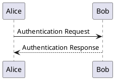

# Pandoc Professional PDF Converter

Questo progetto fornisce un ambiente Docker autoconsistente per convertire documenti Markdown complessi in file PDF dall'aspetto professionale. È specificamente progettato per gestire Markdown che include diagrammi testuali **PlantUML** e **Mermaid**, applicando un templating aziendale completo.

## Problema Risolto

La necessità è quella di superare i limiti dei convertitori standard, che spesso non supportano funzionalità avanzate di templating come:
- Loghi aziendali
- Header e footer personalizzati
- Pagina di copertina
- Sommario (Table of Contents) automatico
- Stili coerenti per tabelle, codice e altri elementi

Questo progetto risolve questi problemi utilizzando la potenza di Pandoc e LaTeX in un ambiente Docker riproducibile.

## Stack Tecnologica

- **Docker:** Per creare un ambiente di esecuzione isolato e consistente con tutte le dipendenze necessarie.
- **Pandoc:** Il "coltellino svizzero" per la conversione di documenti.
- **LaTeX (TeX Live):** Per la composizione tipografica di alta qualità e la generazione del PDF finale.
- **PlantUML:** Per renderizzare i diagrammi UML da codice.
- **Mermaid CLI:** Per renderizzare i diagrammi Mermaid da codice.
- **Filtri Pandoc (Lua/Python):** Script che pre-processano i blocchi di diagramma, convertendoli in immagini prima che Pandoc li passi a LaTeX.

## Struttura del Progetto

```
.
├── Dockerfile           # Definizione dell'immagine Docker con tutte le dipendenze
├── README.md            # Questo file
├── assets/              # Risorse statiche
│   └── logo.png         # Logo aziendale da includere nel template
├── filters/             # Filtri Pandoc per la gestione dei diagrammi
│   ├── mermaid.lua      # Filtro per convertire i blocchi Mermaid in immagini
│   └── plantuml.lua     # Filtro per convertire i blocchi PlantUML in immagini
├── input/               # Directory dove inserire i file .md da convertire
│   └── documento.md     # Esempio di file markdown
├── output/              # Directory dove verranno salvati i PDF generati
└── templates/           # Template per la conversione
    └── professional.tex # Template LaTeX personalizzato per header, footer, TOC, ecc.
```

## Utilizzo

### Prerequisiti
- [Docker](https://www.docker.com/get-started) installato e in esecuzione.

### 1. Build dell'Immagine Docker

La prima volta, è necessario costruire l'immagine Docker. Dalla root del progetto, eseguire:

```bash
docker build -t pandoc-converter .
```

### 2. Esecuzione della Conversione

1. Posizionare i file sorgente `.md` nella directory `input/`.
2. Eseguire il comando di conversione:

```bash
docker run --rm -v "$(pwd)/input:/app/input" -v "$(pwd)/output:/app/output" pandoc-converter NOME_FILE.md
```

Sostituire `NOME_FILE.md` con il nome del file da convertire. Il PDF risultante verrà creato nella directory `output/`.

## Scrivere i Documenti Markdown

Perché i diagrammi vengano riconosciuti e convertiti correttamente, è necessario utilizzare i seguenti blocchi di codice specifici.

### PlantUML

````markdown

````

### Mermaid

````markdown

````

## Personalizzazione

- **Template LaTeX:** Modificare il file `templates/professional.tex` per cambiare la struttura del documento (es. layout della pagina di copertina, header, footer).
- **Logo:** Sostituire il file `assets/logo.png` con il proprio logo.
- **Stili e Variabili Pandoc:** È possibile estendere il comando nel `Dockerfile` per includere ulteriori opzioni di Pandoc, come variabili personalizzate (`-V key=value`) o stili di citazione.


docker run --rm --volume ".:/data" pandoc-md --defaults /data/diagram-filter.yaml --lua-filter diagram.lua /data/input/FR-Migration-Guidelines-v1.md -o /data/input/outfile.pdf --template eisvogel --listings --pdf-engine=lualatex --number-sections

docker run --rm --volume ".:/data" pandoc-md --defaults /data/diagram-filter.yaml --lua-filter diagram.lua /data/input/FR-Migration-Guidelines-v1.md -o /data/input/outfile.pdf --from markdown --template eisvogel --listings --pdf-engine "tectonic" --number-sections