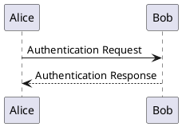

# Pandoc Professional PDF Converter

Questo progetto fornisce un ambiente Docker autoconsistente per convertire documenti Markdown complessi in file PDF dall'aspetto professionale. È specificamente progettato per gestire Markdown che include diagrammi testuali **PlantUML** e **Mermaid**, applicando un templating aziendale completo.

## Problema Risolto

La necessità è quella di superare i limiti dei convertitori standard, che spesso non supportano funzionalità avanzate di templating come:
- Loghi aziendali
- Header e footer personalizzati
- Pagina di copertina
- Sommario (Table of Contents) automatico
- Stili coerenti per tabelle, codice e altri elementi

Questo progetto risolve questi problemi utilizzando la potenza di Pandoc e LaTeX in un ambiente Docker riproducibile.

## Stack Tecnologico

- **Docker:** Per creare un ambiente di esecuzione isolato e consistente con tutte le dipendenze necessarie.
- **Pandoc:** Il "coltellino svizzero" per la conversione di documenti.
- **LaTeX (TeX Live):** Per la composizione tipografica di alta qualità e la generazione del PDF finale.
- **PlantUML:** Per renderizzare i diagrammi UML da codice.
- **Mermaid CLI:** Per renderizzare i diagrammi Mermaid da codice.
- **Filtri Pandoc (Lua/Python):** Script che pre-processano i blocchi di diagramma, convertendoli in immagini prima che Pandoc li passi a LaTeX.

Per la documentazione del template, ovvero per personalizzarlo, si può consultare il seguente link: [Pandoc LaTeX Template](https://github.com/Wandmalfarbe/pandoc-latex-template)

## Utilizzo

### Prerequisiti
- [Docker](https://www.docker.com/get-started) installato e in esecuzione.

### 1. Build dell'Immagine Docker

La prima volta, è necessario costruire l'immagine Docker. Dalla root del progetto, eseguire:

```bash
docker build -t pandoc-md .
```

### 2. Esecuzione della Conversione del file `input/sample.md`

1. Eseguire il comando di conversione:

```bash
docker run --rm --volume ".:/data" pandoc-md --defaults diagram-filter --lua-filter diagram.lua /data/input/sample.md -o /data/sample.pdf --template eisvogel --listings --pdf-engine=lualatex --number-sections --filter pandoc-latex-environment
```

## Scrivere i Documenti Markdown

Perché i diagrammi vengano riconosciuti e convertiti correttamente, è necessario utilizzare i seguenti blocchi di codice specifici.

### PlantUML

````markdown

````

### Mermaid

````markdown

````

inoltre nel file di esempio ci sono le formattazioni latex per i box con le icone e le colorazioni, ad esempio:

```text
::: info
**Info**: This is a custom box that may be used to show info messages in your
document.
:::

::: warning
**Warning**: This is a custom box that may be used to show warning messages in
your document.
:::

::: error
**Error**: This is a custom box that may be used to show error messages in your
document.
:::
```
