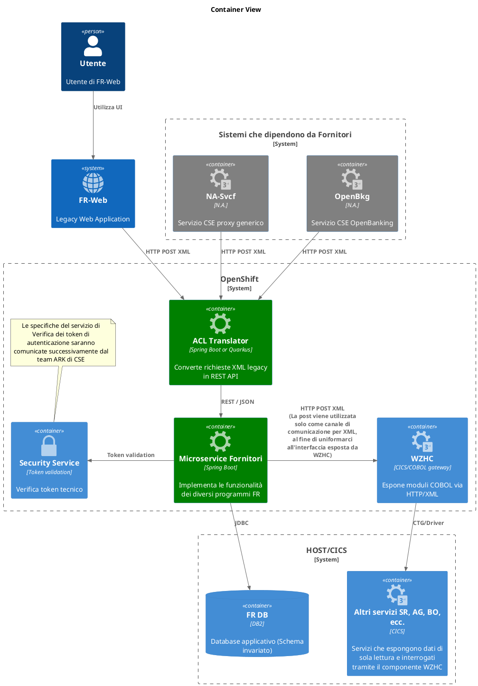

# Documento di Linee Guida Architetturali per la Modernizzazione Componenti FR (progetto CSE Fornitori - FASE 2)

## Introduzione

### Scopo del documento
Questo documento definisce l'approccio architetturale, le best practice e le linee guida per la modernizzazione degli applicativi Cobol (denominati FR) da ambiente HOST a piattaforma cloud-native su OpenShift. L'obiettivo è fornire una visione completa della trasformazione tecnologica che va oltre la semplice migrazione del codice, abbracciando principi di architettura moderna, osservabilità avanzata e operational excellence.

### Contesto e obiettivi strategici
La reingegnerizzazione di FR-Fornitori rappresenta un'opportunità strategica per CSE di modernizzare la propria infrastruttura tecnologica, migliorare l'agilità di business e ridurre la dipendenza dal mainframe legacy. Gli obiettivi chiave includono:

1. **Modernizzazione tecnologica**: Transizione da architettura monolitica mainframe a microservizi cloud-native
2. **Miglioramento dell'agilità**: Abilitazione di cicli di sviluppo più rapidi e deployment continuo
3. **Riduzione dei costi operativi**: Ottimizzazione delle risorse e automazione dei processi
4. **Incremento della resilienza**: Implementazione di pattern di fault tolerance e disaster recovery
5. **Abilitazione dell'osservabilità**: Implementazione di monitoring, logging e tracing distribuito
6. **Preparazione per il futuro**: Creazione di fondamenta per ulteriori innovazioni tecnologiche

| AS-IS | TO-BE |
|-------|-------|
| Componenti FR in ambiente HOST | Funzionalità esposte da un microservizio deployato su OpenShift (più FR potrebbero convogliare su singolo microservizio, a seconda del perimetro funzionale considerato) |
| Chiamate sincrone HTTP con payload XML | REST API per i nuovi microservizi; ACL di traduzione per non impattare i consumer legacy |
| Accesso a moduli CICS/COBOL via WZHC | Invariato: i microservizi invocano WZHC via HTTP POST XML |
| Scrittura dati su DB2 | Schema invariato; insert/update gestiti dai microservizi |
| Sicurezza basata su token utente | DA CONFERMARE: token utente -> token tecnico, validazione tramite servizio esterno |

### Principi architetturali guida

#### API-First Design
Ogni componente deve essere progettato con un approccio API-first, garantendo:
- Contratti chiari e documentati (OpenAPI 3.1+)
- Versionamento semantico delle API
- Backward compatibility per ridurre gli impatti sui consumer esistenti
- Design RESTful seguendo il Richardson Maturity Model Level 2+

#### Domain-Driven Design
I microservizi saranno strutturati seguendo i principi DDD:
- Identificazione chiara dei bounded context
- Separazione delle responsabilità per dominio di business
- Implementazione di pattern Anti-Corruption Layer per l'integrazione con sistemi legacy in ingresso

#### Cloud-Native Patterns
Adozione di pattern specifici per ambienti cloud:
- Twelve-Factor App methodology
- Immutable infrastructure
- Configuration as code
- Stateless application design

### Prerequisiti

#### Input richiesti al cliente

| Codice | Descrizione | Note |
|--------|------------|------|
| INP-F1 | Documento di analisi funzionale per ciascun FR (flussi, XSD, regole di business) | Necessario per modellare API e mapping XML-REST |
| INP-F2 | Specifiche del servizio di validazione token (endpoint, formato token, SLA) | Indispensabile per implementare la sicurezza |
| INP-F3 | Dettagli schema DB2 e permessi di accesso | Solo insert/update, nessuna DDL |
| INP-F4 | Finestre di manutenzione e SLA del gateway WZHC | Definisce parametri di timeout e retry |
| INP-F5 | Requisiti NFR numerici (TPS, dimensione payload, latenze massime) | Per capacity planning |
| INP-F6 | Linee guida per il CI/CD (eventuale accesso a OpenShift di DEV da concodare) | Necessita account con privilegi adeguati |

### Assunzioni e vincoli

| ID | Descrizione                                                                                            | Tempi | Costi | Qualità | Note                                                                                           |
|----|--------------------------------------------------------------------------------------------------------|-------|-------|---------|------------------------------------------------------------------------------------------------|
| 1  | Lo schema DB2 non subirà variazioni                                                                    | x     | x     |         | Le variazioni dovranno essere valutate separatamente                                           |
| 2  | WZHC disponibile su rete interna, latenza < 500 ms                                                     | x     | x     | x       | Necessita valutazione e adozione di altre strategie, ad es. caching                            |
| 3  | Payload XML legacy non modificabile                                                                    | x     | x     |         | Modifiche al componente ACL da valutare e pianificare                                          |
| 4  | Politica di sicurezza secondo standard CSE                                                             | x     | x     |         | Devono essere fornite le specifiche complete e in tempo utile                                  |
| 5  | Infrastruttura fornita e gestita dal cliente                                                           | x     | x     |         | La gestione dell'infrastruttura richiede competenze specifiche e pianificazione delle attività |
| 6  | Analisi funzionali autoconsistenti e senza necessità di dover effettuare reverse engineering dal Cobol |       |       |         | Revisione del piano e riunione steering-committee per definire la nuova strategia              |

### RACI alto livello

| Attivita | Cliente | Fornitore |
|----------|---------|-----------|
| Fornitura documenti funzionali | A/R | C |
| Definizione architettura | C | A/R |
| Sviluppo microservizi | I | A/R |
| Amministrazione Infrastruttura | A/R | I |
| Specifiche di sicurezza | A/R | I |
| Installazione in produzione | A/R | C |

Legenda: R Responsible, C Consulted, I Informed, A Accountable

> *n.b.: l'attività di Sviluppo microservizi" include sempre le seguenti:*
> - documentazione tecnica (markdown da caricare su wiki del cliente o export PDF in alternativa)
> - sviluppo
> - build
> - unit-test
> - push su repository del cliente

---

## Architettura Target

### Vista architetturale

**Linee guida per la definizione dei confini per la progettazione dei microservizi**

Per il dominio "fornitori", la scelta architetturale predefinita è la realizzazione di un singolo microservizio, che espone tutte le funzionalità oggi esposte dai programmi cobol dedicati (FR-Fornitori), salvo che emergano forti motivazioni architetturali per una suddivisione in più microservizi. La creazione di più microservizi sarà valutata solo in presenza di requisiti specifici che giustifichino la separazione (es. scalabilità autonoma, subdomini funzionali distinti con processi ad-hoc, requisiti di resilienza o compliance, necessità di evoluzione indipendente).

Questa scelta è guidata dai seguenti principi:
- **Ubiquitous Language e DDD**: i confini dei microservizi devono riflettere i bounded context del dominio, evitando frammentazioni artificiali.
- **Semplificazione operativa**: un singolo microservizio riduce la complessità di gestione, deployment e test, soprattutto in presenza di un unico schema DB2 condiviso.
- **Vincoli legacy**: la persistenza su DB2 e l'integrazione con WZHC impongono una coerenza transazionale che favorisce un approccio monolitico o single-service.
- **Testing e governance**: la strategia di test e la gestione delle dipendenze sono semplificate con un perimetro funzionale chiaro e unitario.

La suddivisione in più microservizi sarà adottata solo se porta un valore aggiunto concreto e misurabile, in linea con le best practice cloud-native e le esigenze di business. In assenza di tali motivazioni, la soluzione raccomandata è un unico microservizio FR-Fornitori.

Un componente di Anti-Corruption Layer garantisce che gli attuali software FR-Web ed altre dipendenze non abbiano regressioni, seguendo di fatto un approccio di tipo **hybrid-modernization** che consente una transizione graduale mantenendo la continuità operativa. Di seguito uno schema riepilogativo della soluzione:

### Componenti architetturali in scope

#### FR Microservices

- **Tecnologia**: Spring Boot
- **Responsabilità**:
  - Esposizione API REST per le funzionalità di business
  - Orchestrazione delle chiamate verso sistemi legacy in sola lettura
  - Implementazione della business logic modernizzata
  - Gestione dello stato transazionale e scrittura su DB2
  - Caching intelligente per ottimizzazione performance

#### Anti-Corruption Layer (ACL) Translator
- **Tecnologia**: Spring Boot
- **Responsabilità**:
  - Traduzione protocolli: XML ↔ JSON
  - Mapping dei data model legacy verso API moderne
  - Gestione della compatibilità all'indietro
  - Rate limiting e circuit breaker per protezione sistemi legacy (da valutare in corso d'opera)

---

## Scelte Tecnologiche

| Area | Scelta | Motivazione |
|------|--------|-------------|
| Runtime | Java 21 + acceleratori di microservizi es. Spring Boot | Startup rapida, footprint ridotto, supporto nativo framework di osservabilità (es. OpenTelemetry per integrazione con Dynatrace) |
| API | REST / JSON (Richardson Lvl 2) | Standard web, evoluzione semplice |
| Persistenza | IBM DB2 JDBC + JPA | Riuso schema esistente |
| Integrazione WZHC | HTTP POST XML (sync) | Integrazione tramite layer esistente CSE |
| Observability | UUID di tracing negli header | Tracing end-to-end |

---

## Best Practice di Implementazione

### Progettazione delle REST API

* Versionamento esplicito (`/v1/...`).
* Nomi risorsa al plurale, evitare verbi nel path.
* Error model standard (`code`, `message`, `details`).
* Correlation-ID (`X-Request-Id`) propagato.
* Rate limiting a livello ingress (Route o API-Gateway).

### Integrazione con WZHC

* Command pattern per incapsulare chiamata e trasformazione XML.
* Timeout 2-5 s con retry limitato (solo operazioni di lettura).
* Circuit breaker con fallback HTTP 503.
* XSD versionato e validazione in/out.

### Accesso a DB2

* Transazioni brevi, commit immediato.
* Connection pool dimensionato via risorse pod.
* Optimistic locking dove applicabile.

### Sicurezza

* Token utente passato all'ACL -> viene propagato al servizio di business che lo verifica tramite servizio esterno. Politiche di caching da verificare.
* Secrets (credenziali DB2, chiavi JWT) in OpenShift Secrets (**Da Confermare tramite ARK CSE**).

### Resilienza

| Failure scenario | Mitigazione |
|------------------|------------|
| WZHC non disponibile | Retry x3 con back-off, circuito aperto 30 s |
| DB2 lento | Timeout query, metriche di monitoraggio (es. Dynatrace) |
| Security service down | Cache autorizzazioni max 60 s, degrade 503 |

### Scope, responsabilità e criteri dei test di integrazione

I test di integrazione previsti saranno svolti sui seguenti ambiti, con l’obiettivo di verificare la corretta interazione tra i componenti principali e la raggiungibilità degli ambienti. Tutte le attività non esplicitamente elencate sono escluse dal perimetro (in particolare, non sono previsti test di performance).

**Test di integrazione previsti:**
- Verifica della comunicazione tra:
  - ACL Translator ↔ FR-Microservice (scambio XML/JSON)
  - FR-Microservice ↔ WZHC (HTTP POST XML)
  - FR-Microservice ↔ DB2 (connessione al database)
  - FR-Microservice ↔ Security Service (validazione token)
  - FR-Web ↔ ACL Translator (simulazione chiamate reali)
  - NS-Svcf ↔ ACL Translator (simulazione chiamate reali)
  - OpenBkg ↔ ACL Translator (simulazione chiamate reali)
- Simulazione di fault principali:
  - Indisponibilità temporanea di WZHC, DB2, Security Service (es. disconnessione, endpoint non raggiungibile)
  - Errori di configurazione (es. credenziali errate)
  - Verifica della gestione di timeout e errori di connessione

**Modalità di esecuzione:**
- I test saranno condotti manualmente o tramite strumenti di test standard, senza sviluppi ad hoc.
- Il numero di test sarà limitato ai flussi principali e ai fault concordati in fase di pianificazione (indicativamente 1 test per ciascun flusso e 1 test per ciascun fault critico).

**Responsabilità del cliente:**
- Predisporre e gestire l’ambiente di integrazione, inclusa la configurazione di tutti i sistemi coinvolti e la preparazione dei dati necessari.
- Fornire supporto operativo per eventuali ripristini, configurazioni o simulazioni di fault.

**Criteri di accettazione:**
- I test si considerano superati quando:
  - Tutti i componenti sono accessibili e comunicano correttamente secondo le specifiche.
  - Il sistema gestisce correttamente le principali condizioni di errore previste.
- Tutte le attività non esplicitamente elencate (es. test di performance, test funzionali approfonditi, ripristino ambienti, data preparation) sono escluse dal perimetro.

## Osservabilità

### Logging strutturato

* Formato JSON in console.
* Chiavi minime: timestamp, level, service, requestId, user, event.

### Tracing distribuito

* Generazione di header di tracciamento e correlazione

### Metriche applicative

* esposizione di metriche tramite framework best-of-breed open source (es. Spring Boot Actuator)

### Alerting e SLO

Nota: **NON INCLUSO NEL PERIMETRO DI OFFERTA**

Si consiglia di impostare un sistema di allarmi su Dynatrace allo scopo di reagire adeguatamente e prevedere quando possibile i guasti, ad esempio:

| Indicatore | Obiettivo | Trigger alert |
|------------|-----------|---------------|
| Availability FR-MS | >= 99.5 % | Error rate > 1 % per 5 min |
| P95 latency WZHC | < 800 ms | Latency > 1 s per 5 min |
| Heap usage | < 75 % | > 85 % per 15 min |
| DB Latency | < 500 ms | Latency > 1 s per 3 min

Si consiglia inoltre la creazione di Dashboard Dynatrace ad-hoc per il perimetro progettuale di riferimento.

---

## Governance e Documentazione

* Documentazione tecnica in template Markdown, preferibilmente da caricare sul wiki di compagnia (es. Gitlab, Confluence, ecc.)
* OpenAPI pubblicato su developer portal, change-log SemVer.
* Runbook per ogni microservizio (startup, health-check, errori comuni).
* Collegamento commit -> ticket (es. Jira).

---

## Deliverable forniti da GFT

| Milestone | Deliverable | Formato | Criterio di accettazione |
|-----------|------------|---------|-------------------------|
| Design | Specifiche OpenAPI per ogni FR | Swagger 2.0, OpenAPI 3.* | Validazione con team di business/ARK CSE |
| Sviluppo | Documentazione, Codice microservizi e codice ACL | Repository Git CSE | Build e unit test verdi, coverage >= 80% |
| Continuous Delivery | (opzionale) supporto e linee guida per deploy su Openshift (es. per Manifest Helm / ArgoCD) | YAML | Deploy su ambiente test |
| Observability | (opzionale) supporto/sviluppo dashboard Dynatrace e alerting SLO | JSON/Dynatrace | Dashboard e verifica metriche e soglie |
| Test | Report funzionali, performance, sicurezza | PDF | Superamento criteri da concordare e come da perimetro offerta |
| Go-live | Runbook operativo e sessione training | PDF / workshop | Firma di accettazione operativa |
---

## Conclusioni

La reingegnerizzazione FR-Fornitori rappresenta più di una semplice migrazione tecnologica: è un'opportunità di trasformazione digitale che può posizionare CSE all'avanguardia nel settore bancario. L'approccio consultivo proposto non si limita alla delivery tecnica, ma abbraccia un'visione olistica che include:

- **Architettura future-proof** basata su standard e best practice consolidate
- **Operational excellence** attraverso osservabilità avanzata e automation
- **Risk mitigation** attraverso strategie di migration graduali e testate
- **Knowledge transfer** per garantire autonomia e crescita interna
- **Continuous improvement** per mantenere il vantaggio competitivo nel tempo

Il successo di questo progetto creerà le fondamenta per ulteriori iniziative di modernizzazione e posizionerà CSE come reference nel settore per l'adozione di tecnologie cloud-native nel banking.