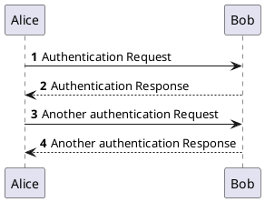
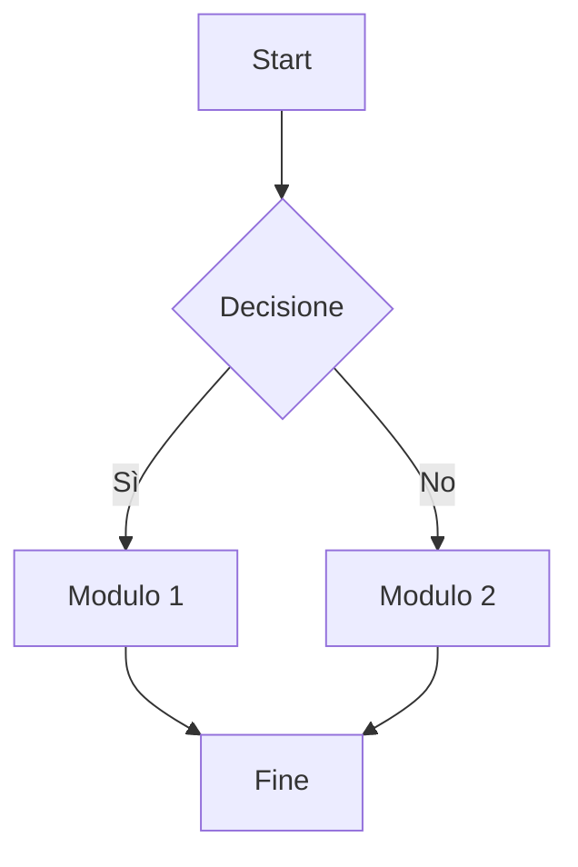

# Introduzione

Questo è un documento di esempio per dimostrare le capacità del convertitore basato su Pandoc e LaTeX. Include testo formattato, elenchi e diagrammi generati dinamicamente.

## Diagramma di Sequenza (PlantUML)

Il seguente diagramma mostra un semplice flusso di autenticazione.

## Diagramma a Grafo (Mermaid)

Questo diagramma illustra una semplice relazione tra componenti.

# Conclusione

Come si può vedere, i diagrammi sono stati renderizzati e inclusi correttamente nel documento, che seguirà il layout definito nel template LaTeX.
