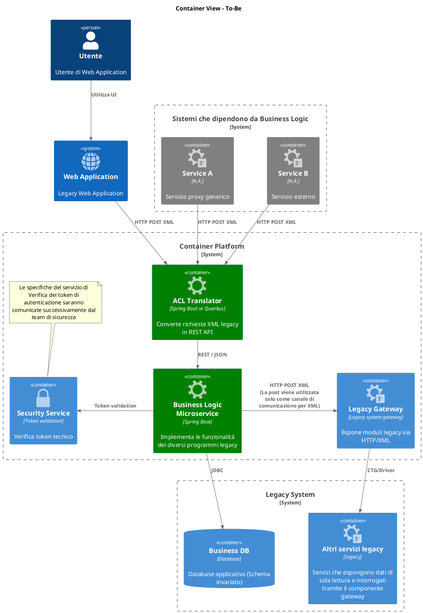

# Overview Architetturale

## Principi architetturali guida

### API-First Design

Ogni componente deve essere progettato con un approccio API-first, garantendo:

- Contratti chiari e documentati (OpenAPI 3.1+)
- Versionamento semantico delle API
- Backward compatibility per ridurre gli impatti sui consumer esistenti
- Design RESTful seguendo il Richardson Maturity Model Level 2+

### Domain-Driven Design

I microservizi saranno strutturati seguendo i principi DDD:

- Identificazione chiara dei bounded context
- Separazione delle responsabilità per dominio di business
- Implementazione di pattern Anti-Corruption Layer per l'integrazione con sistemi legacy in ingresso

### Cloud-Native Patterns

Adozione di pattern specifici per ambienti cloud:

- Twelve-Factor App methodology
- Immutable infrastructure
- Configuration as code
- Stateless application design

### Linee guida per la definizione dei confini per la progettazione dei microservizi

Per il dominio di riferimento "Business Logic", la scelta architetturale predefinita è la realizzazione di un singolo microservizio, che espone tutte le funzionalità oggi esposte dai programmi legacy dedicati, salvo che emergano forti motivazioni architetturali per una suddivisione in più microservizi. La creazione di più microservizi sarà valutata solo in presenza di requisiti specifici che giustifichino la separazione (es. scalabilità autonoma, subdomini funzionali distinti con processi ad-hoc, requisiti di resilienza o compliance, necessità di evoluzione indipendente).

Questa scelta è guidata dai seguenti principi:

* **Ubiquitous Language e DDD**: i confini dei microservizi devono riflettere i bounded context del dominio, evitando frammentazioni artificiali.
* **Semplificazione operativa**: un singolo microservizio riduce la complessità di gestione, deployment e test, soprattutto in presenza di un unico schema database condiviso.
* **Vincoli legacy**: la persistenza su database e l'integrazione con gateway impongono una coerenza transazionale che favorisce un approccio monolitico o single-service.
* **Testing e governance**: la strategia di test e la gestione delle dipendenze sono semplificate con un perimetro funzionale chiaro e unitario.

La suddivisione in più microservizi sarà adottata solo se porta un valore aggiunto concreto e misurabile, in linea con le best practice cloud-native e le esigenze di business. In assenza di tali motivazioni, la soluzione raccomandata è un unico microservizio **Business-Logic-Microservice**.

Un componente di **Anti-Corruption Layer** garantisce che gli attuali software legacy ed altre dipendenze non abbiano regressioni, seguendo di fatto un approccio di tipo **hybrid-modernization** che consente una transizione graduale mantenendo la continuità operativa.

## Vista architetturale

## Componenti architetturali in scope

### Business Logic Microservice

- **Tecnologia**: Spring Boot
- **Responsabilità**:
  - Esposizione API REST per le funzionalità di business
  - Orchestrazione delle chiamate verso sistemi legacy in sola lettura
  - Implementazione della business logic modernizzata
  - Gestione dello stato transazionale e scrittura su database
  - Caching intelligente per ottimizzazione performance

### Anti-Corruption Layer (ACL) Translator
- **Tecnologia**: Spring Boot
- **Responsabilità**:
  - Traduzione protocolli: XML ↔ JSON
  - Mapping dei data model legacy verso API moderne
  - Gestione della compatibilità all'indietro
  - Rate limiting e circuit breaker per protezione sistemi legacy (da valutare in corso d'opera)

---

## Scelte Tecnologiche

| Area | Scelta | Motivazione |
|------|--------|-------------|
| Runtime | Java 21 + acceleratori di microservizi es. Spring Boot | Startup rapida, footprint ridotto, supporto nativo framework di osservabilità (es. OpenTelemetry per integrazione con strumenti di monitoraggio) |
| API | REST / JSON (Richardson Lvl 2) | Standard web, evoluzione semplice |
| Persistenza | Database JDBC + JPA | Riuso schema esistente |
| Integrazione Gateway | HTTP POST XML (sync) | Integrazione tramite layer esistente |
| Observability | UUID di tracing negli header | Tracing end-to-end |

---

## Best Practice di Implementazione

### Progettazione delle REST API

* Versionamento esplicito (`/v1/...`).
* Nomi risorsa al plurale, evitare verbi nel path.
* Error model standard (`code`, `message`, `details`).
* Correlation-ID (`X-Request-Id`) propagato.
* Rate limiting a livello ingress (Route o API-Gateway).

### Integrazione con Gateway Legacy

* Command pattern per incapsulare chiamata e trasformazione XML.
* Timeout 2-5 s con retry limitato (solo operazioni di lettura).
* Circuit breaker con fallback HTTP 503.
* XSD versionato e validazione in/out.

### Accesso a Database

* Transazioni brevi, commit immediato.
* Connection pool dimensionato via risorse pod.
* Optimistic locking dove applicabile.

### Sicurezza

* Token utente passato all'ACL -> viene propagato al servizio di business che lo verifica tramite servizio esterno. Politiche di caching da verificare.
* Secrets (credenziali database, chiavi JWT) in container platform Secrets.

::: warning
Le attività legate al perimetro di sicurezza saranno approfondite e valutate in seguito alla ricezione della documentazione specifica.
:::

### Resilienza

| Failure scenario | Mitigazione |
|------------------|------------|
| Gateway non disponibile | Retry x3 con back-off, circuito aperto 30 s |
| Database lento | Timeout query, metriche di monitoraggio |
| Security service down | Cache autorizzazioni max 60 s, degrade 503 |

### Scope, responsabilità e criteri dei test di integrazione

I test di integrazione previsti saranno svolti sui seguenti ambiti, con l'obiettivo di verificare la corretta interazione tra i componenti principali e la raggiungibilità degli ambienti. Tutte le attività non esplicitamente elencate sono escluse dal perimetro (in particolare, non sono previsti test di performance).

**Test di integrazione previsti:**

- Verifica della comunicazione tra:
  - ACL Translator ↔ Business-Microservice (scambio XML/JSON)
  - Business-Microservice ↔ Gateway (HTTP POST XML)
  - Business-Microservice ↔ Database (connessione al database)
  - Business-Microservice ↔ Security Service (validazione token)
  - Web-App ↔ ACL Translator (simulazione chiamate reali)
  - Service-A ↔ ACL Translator (simulazione chiamate reali)
  - Service-B ↔ ACL Translator (simulazione chiamate reali)
- Simulazione di fault principali:
  - Indisponibilità temporanea di Gateway, Database, Security Service (es. disconnessione, endpoint non raggiungibile)
  - Errori di configurazione (es. credenziali errate)
  - Verifica della gestione di timeout e errori di connessione

**Modalità di esecuzione:**

- I test saranno condotti manualmente o tramite strumenti di test standard, senza sviluppi ad hoc.
- Il numero di test sarà limitato ai flussi principali e ai fault concordati in fase di pianificazione (indicativamente 1 test per ciascun flusso e 1 test per ciascun fault critico).

**Responsabilità del cliente:**

- Predisporre e gestire l'ambiente di integrazione, inclusa la configurazione di tutti i sistemi coinvolti e la preparazione dei dati necessari.
- Fornire supporto operativo per eventuali ripristini, configurazioni o simulazioni di fault.

**Criteri di accettazione:**

- I test si considerano superati quando:
  - Tutti i componenti sono accessibili e comunicano correttamente secondo le specifiche.
  - Il sistema gestisce correttamente le principali condizioni di errore previste.
- Tutte le attività non esplicitamente elencate (es. test di performance, test funzionali approfonditi, ripristino ambienti, data preparation) sono escluse dal perimetro.

## Osservabilità

### Logging strutturato

* Formato JSON in console.
* Chiavi minime: timestamp, level, service, requestId, user, event.

### Tracing distribuito

* Generazione di header di tracciamento e correlazione

### Metriche applicative

* esposizione di metriche tramite esposizione `Spring Boot Actuator`
* da concordare tempi e costi di eventuali estensioni e personalizzazioni di metriche aggiuntive, non già incluse nel framework, che richiedessero sviluppi o personalizzazioni a codice

### Alerting e SLO

::: tip
Si consiglia di impostare un sistema di allarmi sullo strumento di monitoraggio allo scopo di reagire adeguatamente e prevedere quando possibile i guasti. Si consiglia inoltre la creazione di Dashboard ad-hoc per il perimetro progettuale di riferimento. Di seguito alcuni esempi, a solo scopo indicativo.
:::

> Esempio di metriche:

| Indicatore | Obiettivo | Trigger alert |
|------------|-----------|---------------|
| Availability Business-MS | >= 99.5 % | Error rate > 1 % per 5 min |
| P95 latency Gateway | < 800 ms | Latency > 1 s per 5 min |
| Heap usage | < 75 % | > 85 % per 15 min |
| DB Latency | < 500 ms | Latency > 1 s per 3 min

::: important
Le attività di configurazione, creazione dashboard e allarme sono escluse dal perimetro di offerta.
:::

---

# Governance e Documentazione

* Documentazione tecnica in template Markdown, preferibilmente da caricare sul wiki di compagnia (es. Gitlab, Confluence, ecc.)
* OpenAPI pubblicato su developer portal, change-log SemVer.
* Runbook per ogni microservizio (startup, health-check, errori comuni).
* Collegamento commit -> ticket (es. Jira).

---

# Deliverable previsti

| Milestone | Deliverable | Formato | Criterio di accettazione |
|-----------|------------|---------|-------------------------|
| Design | Specifiche OpenAPI per ogni componente legacy | Swagger 2.0, OpenAPI 3.* | Validazione con team di business/architettura |
| Sviluppo | Documentazione e codice microservizi | Repository Git | Build e unit test verdi, coverage >= 80% |
| Test di Integrazione | Report test di integrazione | PDF | Superamento dei criteri descritti nel presente documento e in linea con quanto previsto dal perimetro di offerta |
| Go-live | Runbook operativo  | PDF | Firma di accettazione operativa |
---

# Conclusioni

La reingegnerizzazione del sistema legacy rappresenta più di una semplice migrazione tecnologica: è un'opportunità di trasformazione digitale che può posizionare l'azienda all'avanguardia nel settore. L'approccio consultivo proposto non si limita alla delivery tecnica, ma abbraccia un'visione olistica che include:

- **Architettura future-proof** basata su standard e best practice consolidate
- **Operational excellence** attraverso osservabilità avanzata e automation
- **Risk mitigation** attraverso strategie di migration graduali e testate
- **Knowledge transfer** per garantire autonomia e crescita interna
- **Continuous improvement** per mantenere il vantaggio competitivo nel tempo

Il successo di questo progetto creerà le fondamenta per ulteriori iniziative di modernizzazione e posizionerà l'azienda come reference nel settore per l'adozione di tecnologie cloud-native.
