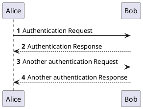
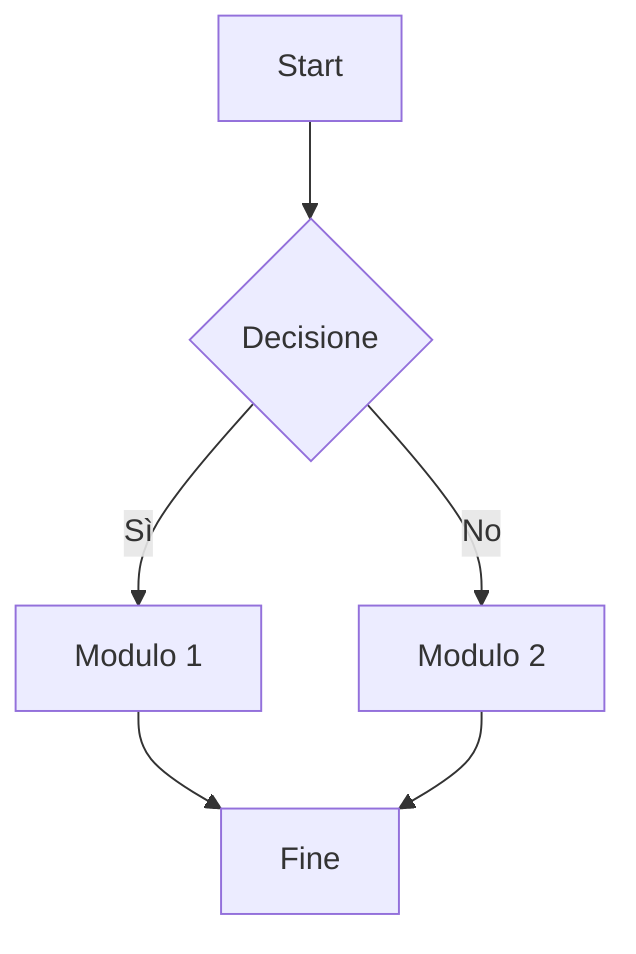

# Introduzione

Questo è un documento di esempio per dimostrare le capacità del convertitore basato su Pandoc e LaTeX. Include testo formattato, elenchi e diagrammi generati dinamicamente.

## Diagramma di Sequenza (PlantUML)

Il seguente diagramma mostra un semplice flusso di autenticazione.



## Diagramma a Grafo (Mermaid)

Questo diagramma illustra una semplice relazione tra componenti.



## Esempio di rendering di una tabella

## Glossario
Definizione dei principali termini tecnici utilizzati nel documento.

| Sigla | Descrizione |
|-------|-------------|
| REST | Representational State Transfer, stile architetturale formato da vincoli, linee guida e best practice che utilizza HTTP per la comunicazione tra client e server. |
| SOAP | Protocollo di messaggistica basato su XML per lo scambio di informazioni strutturate in ambienti distribuiti e utilizzato per le comunicazioni verso i sistemi B2B |
| HLA | High Level Architecture |
| ATE | Analisi Tecnica |
| API | Definizione del contratto con cui un sistema espone il proprio domain ai suoi consumatori |
| DTO | Data Transfer Object, design pattern usato per trasferire dati tra sottosistemi di un'applicazione software |
| HTTP | HyperText Transfer Protocol, protocollo a livello applicativo usato come principale sistema per la trasmissione d'informazioni sul web ovvero in un'architettura tipica client-server |
| HTTP Header | Componente della sezione header dei messaggi di request e response nel HyperText Transfer Protocol |
| JSON | JavaScript Object Notation, formato per lo scambio di dati |
| HTTP status code | Codice identificativo di un particolare stato emesso da un server in risposta alla richiesta di un client effettuata al servizio |
| Producer | Colui che definisce ed espone l’API |
| Consumer | Colui che consuma l’API |
| Resource | Entità di business, un’astrazione che si mappa su un repository tramite un layer intermedio |
| TLS | Transport Layer Security, protocollo crittografico |

------

# Boxes with `pandoc-latex-environment` and `tcolorbox`

This example demonstrates the use of the filter [`pandoc-latex-environments`]
to create custom boxes with the [`tcolorbox`] package.
*pandoc-latex-environment* is a pandoc filter for adding LaTeX environment on
specific HTML div tags. For a list of all available options visit the
[`tcolorbox` documentation](https://ctan.org/pkg/tcolorbox).

## Simple Box

::: box
Lorem ipsum dolor sit amet, consectetur adipiscing elit. Nam aliquet libero
quis lectus elementum fermentum.
:::

## Markdown inside the Box

Markdown formatting inside the environment is supported.

::: box
Lorem ipsum **dolor** sit amet, `consectetur adipiscing` elit.

```
if(args.length < 2) {
	System.out.println("Lorem ipsum dolor sit amet");
}
```

*Nam aliquet libero
quis lectus elementum fermentum.*
:::

## Custom Box

One can define custom boxes in the LaTeX preamble with the variable
`header-includes` at the top of this document.

::: info
**Info**: This is a custom box that may be used to show info messages in your
document.
:::

::: warning
**Warning**: This is a custom box that may be used to show warning messages in
your document.
:::

::: error
**Error**: This is a custom box that may be used to show error messages in your
document.
:::

[`pandoc-latex-environments`]: https://github.com/chdemko/pandoc-latex-environment/
[`tcolorbox`]: https://ctan.org/pkg/tcolorbox

# Boxes with `pandoc-latex-environment` and `awesomebox`

This example demonstrates the use of the filter [`pandoc-latex-environments`] to create custom boxes with the [`awesomebox`] package. *pandoc-latex-environment* is a pandoc filter for adding LaTeX environment on specific HTML div tags.


## Box Types

For a list of all available boxes and options visit the [`awesomebox` documentation](https://ctan.org/pkg/awesomebox).

```markdown
::: note
Lorem ipsum dolor ...
:::
```

::: note
Lorem ipsum dolor sit amet, consectetur adipiscing elit. Nam aliquet libero
quis lectus elementum fermentum.

Fusce aliquet augue sapien, non efficitur mi ornare sed. Morbi at dictum
felis. Pellentesque tortor lacus, semper et neque vitae, egestas commodo nisl.
:::

```markdown
::: tip
Lorem ipsum dolor ...
:::
```

::: tip
Lorem ipsum dolor sit amet, consectetur adipiscing elit. Nam aliquet libero
quis lectus elementum fermentum.

Fusce aliquet augue sapien, non efficitur mi ornare sed. Morbi at dictum
felis. Pellentesque tortor lacus, semper et neque vitae, egestas commodo nisl.
:::

```markdown
::: warning
Lorem ipsum dolor ...
:::
```

::: warning
Lorem ipsum dolor sit amet, consectetur adipiscing elit. Nam aliquet libero
quis lectus elementum fermentum.

Fusce aliquet augue sapien, non efficitur mi ornare sed. Morbi at dictum
felis. Pellentesque tortor lacus, semper et neque vitae, egestas commodo nisl.
:::

```markdown
::: caution
Lorem ipsum dolor ...
:::
```

::: caution
Lorem ipsum dolor sit amet, consectetur adipiscing elit. Nam aliquet libero
quis lectus elementum fermentum.

Fusce aliquet augue sapien, non efficitur mi ornare sed. Morbi at dictum
felis. Pellentesque tortor lacus, semper et neque vitae, egestas commodo nisl.
:::

```markdown
::: important
Lorem ipsum dolor ...
:::
```

::: important
Lorem ipsum dolor sit amet, consectetur adipiscing elit. Nam aliquet libero
quis lectus elementum fermentum.

Fusce aliquet augue sapien, non efficitur mi ornare sed. Morbi at dictum
felis. Pellentesque tortor lacus, semper et neque vitae, egestas commodo nisl.
:::

One can also use raw HTML `div` tags to create the custom environments.

```markdown
<div class="important">
Lorem ipsum dolor ...
</div>
```

<div class="important">
Lorem ipsum dolor sit amet, consectetur adipiscing elit. Nam aliquet libero
quis lectus elementum fermentum.
</div>

Markdown formatting inside the environments is supported.

::: important
**Lorem ipsum dolor** sit amet, `consectetur adipiscing` elit.

```
if(args.length < 2) {
	System.out.println("Lorem ipsum dolor sit amet");
}
```

*Nam aliquet libero
quis lectus elementum fermentum.*
:::

[`pandoc-latex-environments`]: https://github.com/chdemko/pandoc-latex-environment/
[`awesomebox`]: https://ctan.org/pkg/awesomebox